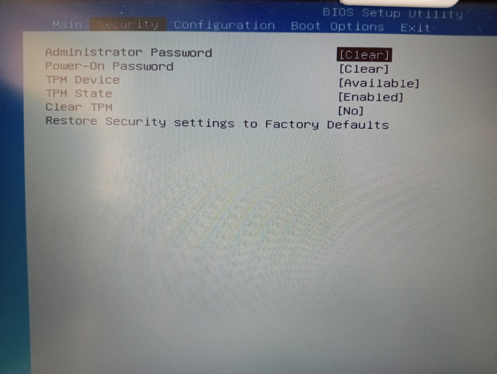
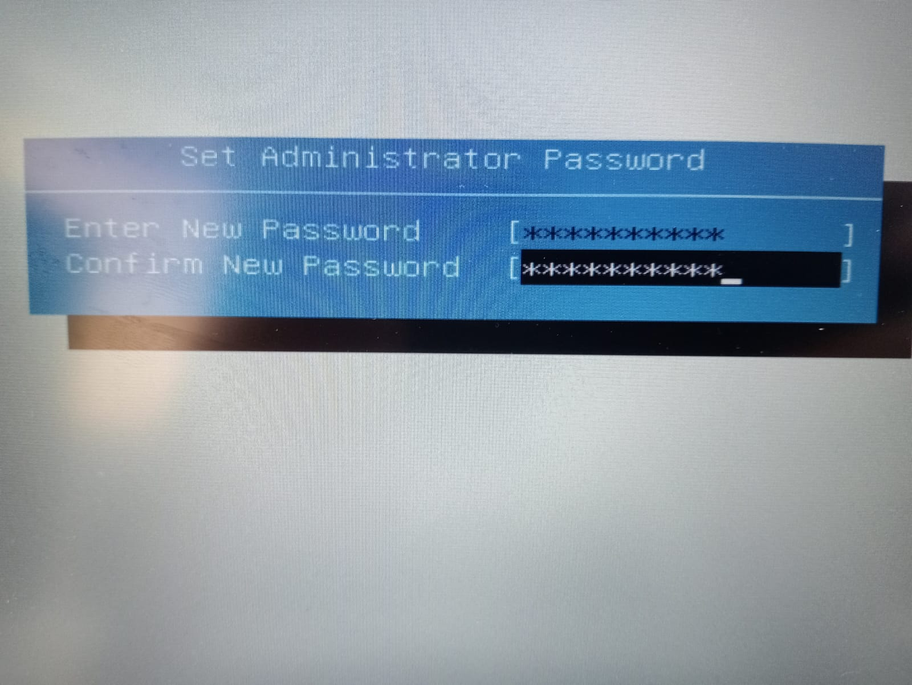
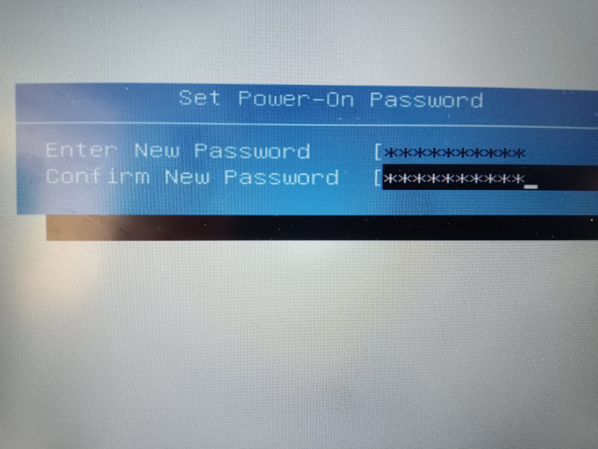
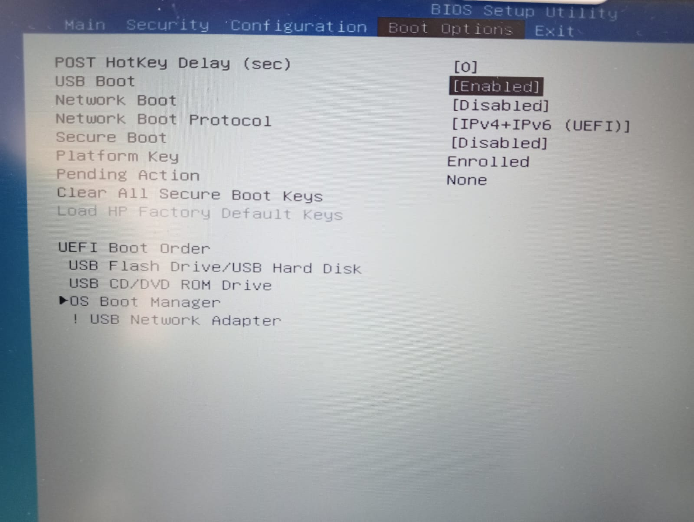
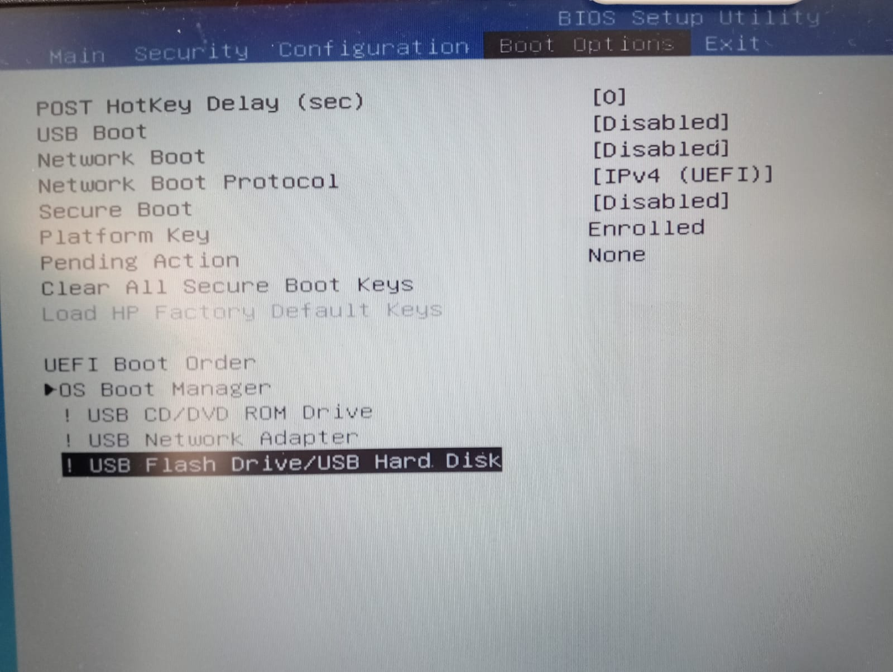
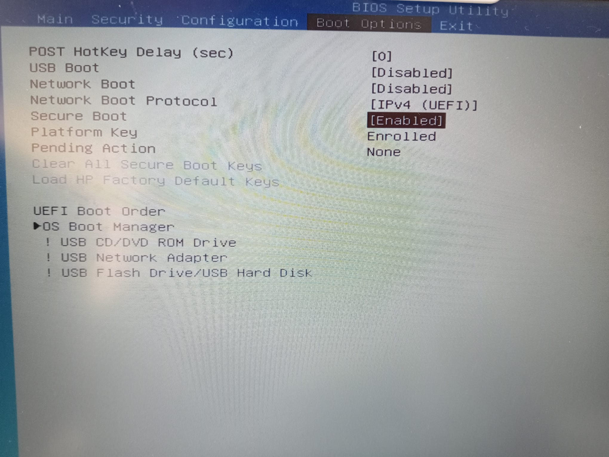
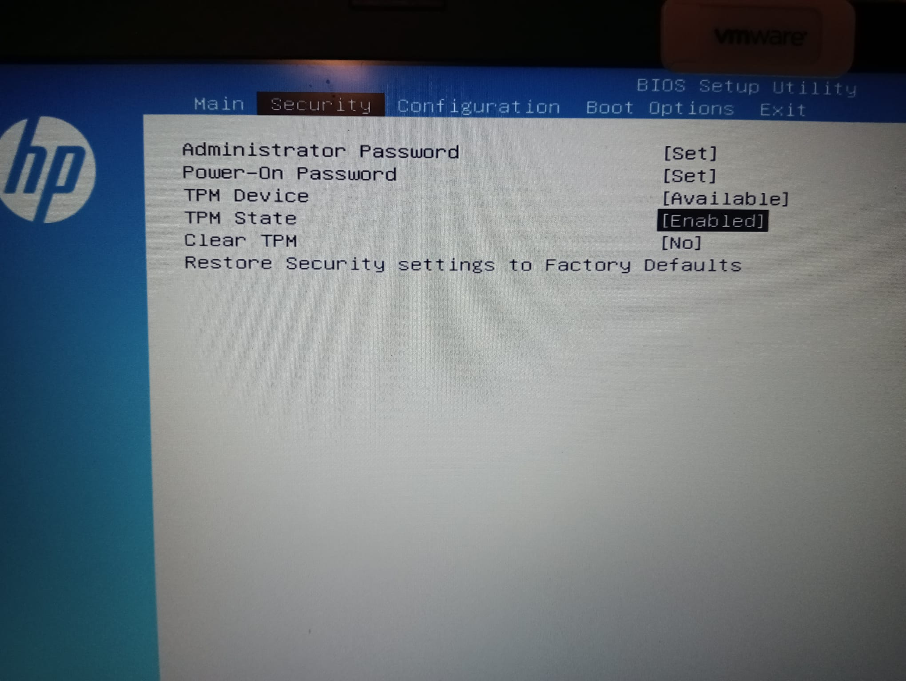

author: Carlos Montesino Fernando
summary: En este codelab quedan expuestos diferentes mecanismos de protección de BIOS/UEFI.
id: BIOS/UEFI
categories: codelab,markdown,BIOS,cybersecurity
environments: Web
status: Published
feedback link: https://github.com/CarlosMontesino02/P1BRS-Bastionado-del-arranque-del-sistema
analytics account: ID de Google Analytics
# Proyecto 1: Bastionado del arranque del sistema

## Introducción
Duration: 0:03:00
### ¿Qué es BIOS/UEFI?
La BIOS (Basic Input/Output System) y su sucesora, UEFI (Unified Extensible Firmware Interface), son componentes fundamentales de cualquier computadora, encargadas de iniciar el hardware y el sistema operativo. Su importancia radica en que actúan como el puente entre el hardware y el software, lo que las convierte en un objetivo crítico para la seguridad informática. Este proyecto se enfocará en explorar qué son la BIOS y UEFI, así como la creciente relevancia de asegurar su integridad y protegerlas de amenazas cibernéticas, dado que cualquier vulnerabilidad en estas interfaces podría tener graves consecuencias para la seguridad de todo el sistema.
### ¿Cómo podemos protegemos BIOS/UEFI?
Entre las principales medidas de protección:

* Contraseñas y bloqueo de arranque: Establecer contraseñas de BIOS/UEFI y bloquear la secuencia de arranque para evitar el acceso no autorizado.

* Actualizaciones regulares: Mantener la BIOS/UEFI actualizada con las últimas versiones de firmware que corrigen vulnerabilidades conocidas.

* Firmas digitales: Utilizar firmas digitales para verificar la autenticidad de las actualizaciones de firmware y detectar cambios no autorizados.

* Habilitar Secure Boot: Activar la función Secure Boot para asegurarse de que solo se ejecuten sistemas operativos y controladores firmados.

* Cifrado de disco: Utilizar cifrado de disco completo para proteger los datos almacenados en el disco duro y dificultar el acceso no autorizado a la BIOS/UEFI.

* Configuración segura: Deshabilitar características innecesarias en la BIOS/UEFI y configurar opciones de seguridad, como la protección de escritura.

* Monitoreo de la integridad: Implementar herramientas de monitoreo de la integridad del firmware para detectar cambios no autorizados en tiempo real.

* Seguridad física: Mantener la seguridad física de la computadora para prevenir el acceso no autorizado a la BIOS/UEFI.

* Contraseñas de administrador: Establecer contraseñas de administrador para acceder a la configuración de la BIOS/UEFI y cambiar la configuración.

* Formación y concienciación: Educar a los usuarios sobre las mejores prácticas de seguridad y la importancia de proteger la BIOS/UEFI.
## Estableciendo contraseñas
Duration: 0:02:00
En la BIOS/UEFI, se pueden configurar dos tipos de contraseñas:

1. Contraseña de usuario (o power-on): Esta contraseña restringe el acceso a la configuración de la BIOS/UEFI. Los usuarios necesitan ingresar esta contraseña para realizar cambios en la configuración, como modificar la secuencia de arranque.

2. Contraseña de administrador o supervisor: Esta contraseña proporciona un nivel más alto de seguridad. Requiere la autorización del administrador o supervisor para cambiar la configuración de la BIOS/UEFI, lo que limita aún más el acceso no autorizado y garantiza un control más estricto sobre las configuraciones críticas del sistema.

### Configuración
Si queremos configurar estas contraseñas, entraremos en la BIOS de nuestro dispositivo, presionando la tecla indicada por el fabricante durante el arranque, tras eso se nos abrirá la interfaz de la BIOS e iremos a el apartado de *Security*, como vemos tenemos ambas contraseñas sin configurar.

Presionaremos la tecla *Enter* en cada una y nos pedirán una contraseña y la confirmación de la misma.

Tras la configuración, se pedirá una contraseña antes de iniciar el gestor de arranque dle sistema y antes de volver a realizar cambios sobr ela BIOS/UEFI.
## Arranque externo y orden de arranque
Duration: 0:02:00
Configurar el orden de arranque y desactivar el arranque desde dispositivos USB y la red es importante para prevenir la ejecución no autorizada de software malicioso y garantizar que el sistema inicie desde fuentes confiables, fortaleciendo así la seguridad del sistema y protegiendo los datos críticos. COmo es obvio, solo nos interesa que se ejecute el sistema que tenemos en el disco interno deel dispositivo.
Para realizar las configuraciones pertienentes, entraremos en la seción de *Boot Options*, como vemos por defecto tenemos el arranque por USB activado y una orden de arranque incorrecto para nuestro propósito.

Tras los cambios pertinentes, desactivamos el arranque por USB y limitamos los protocolos que acepta el arranque en red (aunque esté desactivado por defecto), además cambiamos el orden de arranque a uno más interesante, lo crucial es que sea el gestor de arranque la primera opción y que tanto el USB como la red queden entre las últimas opciones.

## Otras opciones de seguridad
Duration: 0:02:00

Por último tenemos las opciones Secure Boot y TMP.

* "Secure Boot" es una característica que asegura que solo se ejecuten sistemas operativos y controladores con firmas digitales de confianza, reduciendo el riesgo de carga de software malicioso durante el arranque.

* "TPM" (Trusted Platform Module) es un chip de hardware que proporciona funciones de seguridad, como el almacenamiento seguro de claves y la encriptación, contribuyendo a la protección de datos y la autenticación segura en el sistema.

Secure Boot puede ser activada en la sección de *Boot Options*, simplemente necesitamos establecerla en "Enabled".

El TMP se activa en la sección de *Security*, como podemos ver, nuestra placa tiene el chip y está habilitado.

