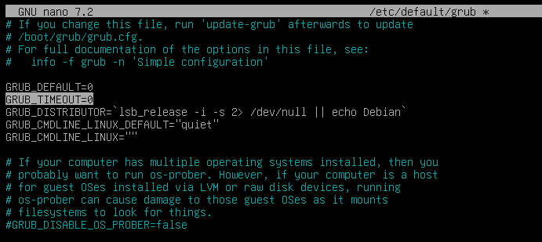
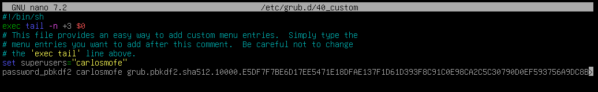
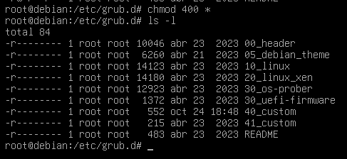

author: Carlos Montesino Fernando
summary: En este codelab quedan expuestos diferentes mecanismos de protección de BIOS/UEFI.
id: GRUB
categories: codelab,markdown,GRUB,cybersecurity
environments: Web
status: Published
feedback link: https://github.com/CarlosMontesino02/P1BRS-Bastionado-del-arranque-del-sistema
analytics account: ID de Google Analytics
# Proyecto 1: Bastionado del arranque del sistema

## Introducción
Duration: 0:03:00
### ¿Qué es GRUB2?
Grub2, el gestor de arranque predeterminado en la mayoría de las distribuciones de Linux, es una pieza crucial en cualquier sistema operativo. Es el punto de inicio que permite seleccionar qué sistema operativo cargar al encender el dispositivo, y su importancia radica en su capacidad para configurar y gestionar el proceso de inicio del sistema. Asegurar Grub2 es esencial, ya que cualquier vulnerabilidad en este componente podría permitir a un atacante tomar el control del sistema o realizar acciones maliciosas antes de que se inicie el sistema operativo. En esta introducción, exploraremos por qué la seguridad de Grub2 es un aspecto crítico de la ciberseguridad y cómo protegerlo de amenazas potenciales es fundamental para garantizar la integridad y la confidencialidad de un sistema. El proecto se realizará en una máquina virtual con un SO Debian 12.2.0.

### ¿Cómo podemos protegemos GRUB2?
Grub tiene varios archivos de configuración que podemos editar para establecer oopciones seguras, para ello necesitamos privilegios de administrador. Los archivos que podemos editar son:

* /etc/default/grub: Este archivo es el archivo de configuración principal para Grub2 en la mayoría de las distribuciones de Linux. Contiene variables y configuraciones que afectan la forma en que Grub2 inicia el sistema. Puedes editar este archivo para cambiar opciones de arranque, como el tiempo de espera para la selección del sistema operativo o la resolución de pantalla durante el arranque.

* /etc/grub.d/: Esta es una carpeta que contiene una serie de scripts de configuración utilizados por Grub2 para generar grub.cfg. Cada script se encarga de configurar diferentes aspectos del arranque, como la detección de sistemas operativos instalados, la configuración de fondos de pantalla, y más. La estructura de esta carpeta permite una gestión modular y sencilla de la configuración de Grub2.

* /boot/grub/grub.cfg: Archivo de configuración generado por Grub2 en función de la información contenida en /etc/default/grub y los scripts en /etc/grub.d/. Grub.cfg es esencial para determinar las opciones de arranque disponibles y su orden. Aunque es posible realizar modificaciones directamente en este archivo, generalmente no se recomienda, ya que las configuraciones se generan a partir de otros archivos de configuración y scripts.

## Editando los ficheros
Duration: 0:02:00
Para securizar GRUB, vamos a intentar ocultarlo de los posible atacantes y adeás establecer un usario y contraseña para desbloquearlo.

Para ocultar GRUB, podremos editar un parámetro en el archivo **/etc/default/grub**, siendo este el parámetro *GRUB_TIMEOUT*, lo que haremos será establecerlo a 0, de forma que el atacante no tenga tiempo a ver el gestor de arranque.

Cada vez que hacemos un cambio en grupo, podemos usar el comando **update-grub**.

Ahora vamos a establecer un usuario y una contraseña para que aparezca tras la interfaz del gestor de arranque, para ello, editaremos el archivo **/etc/grub.d/40_custom**, antes de nada, vamos a crear un hash de una contraseña a elegir y como estamos en una versión sin interfaz gráfica, redireccionamos la salida directamente al fichero.

Tras esto editamos el fichero de la siguiente forma, nótese como el hash está al final de la última linea, hay que tener en cuenta que la contraseña se puede almacenar de diferentes formas, por eso al lado de *password* se utiliza *_pbkdf2*, si no, el sistema quedaría inarrancable puesto que esperaría otra forma de hash y no podría ahcer la correcta comparación de contraseña.

Ahora al arrancar, antes del login normal de Debian, nos aparece esta pantalla:

## Otras formas de asegurar GRUB
Duration: 0:01:00
### Creación de copias de seguridad
Es comprensible que queramos crear copias de seguridad de los ficheros de configuración del arranque, para ello en mi caso, usamos el comando tar, para comprimirlos todos en un único archivo facil de mover, que, lo ideal sería almacenar en un soporte externo y mandarlo directamente a través de un servicio ftp a otro servidor. Para la creación del archivo comprimido usaremos el siguiente comando:

### Permisos sobre los archivos
Una vez explicado esto, hay que tener en cuenta que GRUB es poco seguro por defecto, pero algo más que podemos hacer es cambiar los permisos de los ficheros de configuración a solo lectura para el administrador y nadie más, ya que con los permisos por defecto, una cuenta del sistema comprometida podría visualizar el hash de la cuenta que configuramos anteriormente, para ello hacemos uso del comando **chmod** de la siguiente manera.
